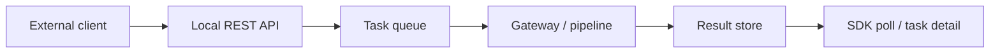
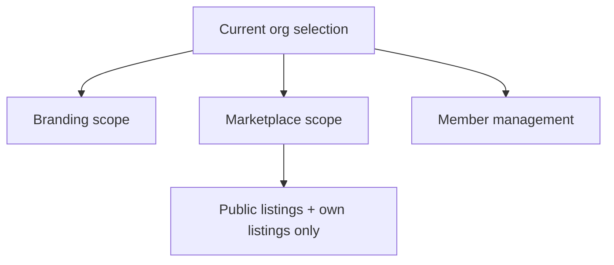

# AgentOS Technical Index

This is the operator and integrator entry point for the real platform surface in this repository.

## Core integration surfaces

- [api-reference.md](./api-reference.md): local REST API contract
- [sdk/javascript-sdk.md](./sdk/javascript-sdk.md): JavaScript reference client
- [sdk/python-sdk.md](./sdk/python-sdk.md): Python reference client
- [platform_standardization.md](./platform_standardization.md): internal platform conventions

## Runtime operations

- [deployment-runbooks.md](./deployment-runbooks.md): desktop deployment, updater, mesh and recovery runbooks
- [platform-support-matrix.md](./platform-support-matrix.md): platform truth table
- [plugin-certification.md](./plugin-certification.md): plugin review expectations

## Capability areas with real backend wiring

- Billing and updater: `src-tauri/src/billing/*`, `src-tauri/src/updater/*`
- Public API: `src-tauri/src/api/*`
- Plugin lifecycle: `src-tauri/src/plugins/*`
- Tenant-aware org and marketplace: `src-tauri/src/enterprise/org.rs`, `src-tauri/src/marketplace/org_marketplace.rs`
- Observability: `src-tauri/src/observability/*`
- Swarm and testing: `src-tauri/src/swarm/*`, `src-tauri/src/testing/*`

## Real request flow

## Tenant-aware surface

## Notes

- This index intentionally points only to docs backed by code that exists in the repository today.
- If a route, command or workflow is not linked here, treat it as non-public or not yet operationally documented.
